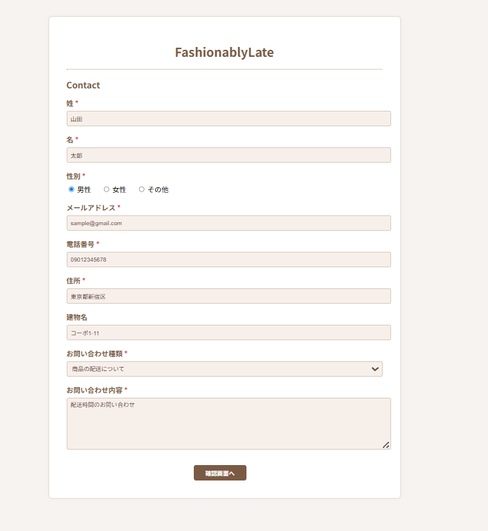
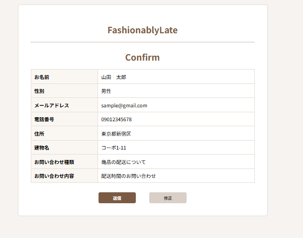
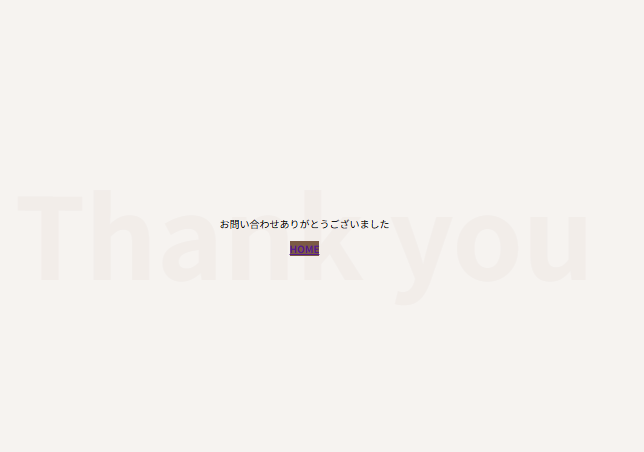
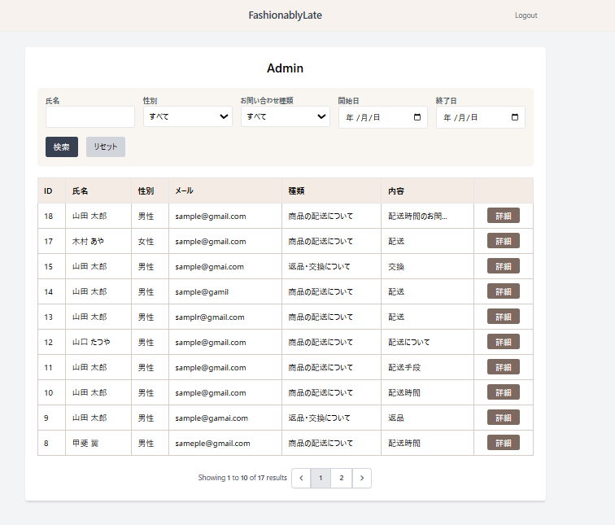
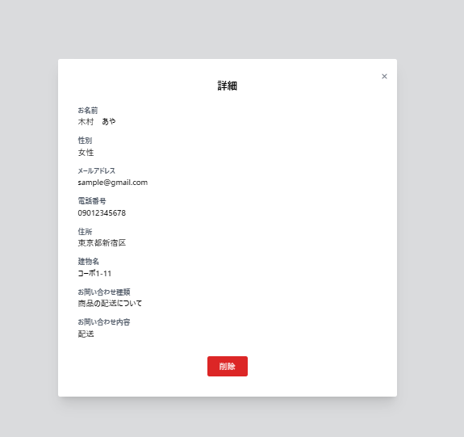
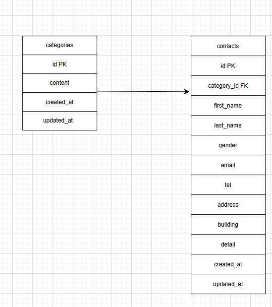

# COACHTECH 基礎学習ターム  
## 📮 確認テスト：お問い合わせフォーム（Docker 版）

本リポジトリは、COACHTECH 基礎学習タームの確認テストとして作成した  
**お問い合わせフォーム Web アプリケーション（Docker 環境）**です。

ユーザーからのお問い合わせを受け取り、管理画面で  
**検索・絞り込み・詳細確認・削除** ができるシステムを構築しました。

---

# 📗 1. 画面一覧（スクリーンショット）

### ■ 入力画面


### ■ 確認画面


### ■ 完了画面


### ■ 管理画面（一覧）


### ■ 管理画面（詳細）


---

# 📌 2. 機能一覧

## ▼ フロント側（ユーザー）

### 【入力画面（/）】
- 姓
- 名
- 性別（男性 / 女性 / その他）
- メールアドレス
- 電話番号
- 住所
- 建物名（任意）
- お問い合わせ種類
- お問い合わせ内容

---

### 【確認画面（/contact/confirm）】
- 入力内容を一覧表示  
- 「修正」「送信」ボタン

---

### 【完了画面（/contact/thanks）】
- 完了メッセージ  
- HOME ボタン

---

## ▼ 管理側（/admin）

### 🔎 **検索・絞り込み機能**
- 氏名検索（姓 / 名 / フルネーム / 半角 / 全角スペース対応）
- 性別検索
- カテゴリ検索
- 期間検索（開始日〜終了日）

---

### 📄 **一覧表示**
- ページネーション（10件ずつ表示）
- ID / 氏名 / 性別 / メール / 種類 / 内容 を表示

---

### 📁 **詳細画面**
- お問い合わせ内容の全項目を表示  
- 削除ボタンあり

---

### 🗑 **削除機能**
- 単体削除  
- 一括削除（チェックボックス対応）

---

### 🔐 **認証**
- Laravel Breeze  
- ログイン後 `/admin` にリダイレクト

---

# 🧱 3. 使用技術

| 種類 | 内容 |
|------|------|
| フレームワーク | Laravel 10.x |
| 言語 | PHP 8.2 |
| 認証 | Laravel Breeze |
| データベース | **MySQL（Docker コンテナ）** |
| CSS | TailwindCSS |
| ビルドツール | Vite |
| 実行環境 | Docker / docker-compose |

---

# 🗂 4. ER 図



---

# 💡 5. こだわったポイント

- UI 仕様に合わせて TailwindCSS で細かくデザイン調整  
- Breeze 認証後の遷移を `/dashboard` → `/admin` に変更  
- 氏名検索は「姓・名・フルネーム・スペース対応」すべて実装  
- 複合検索をクエリビルダで実装  
- 入力 → 確認 → 完了の 3 画面構成  
- Docker による開発環境構築  
- 本番同等（MySQL）で動作確認できるように調整  

---

# ⚙ 6. セットアップ手順（Docker 版）

```bash
# リポジトリをクローン
git clone https://github.com/sayakamasaoka1028-bit/contact-test-docker.git
cd contact-test-docker

# .env を作成
cp .env.example .env

# APP_KEY を生成
docker compose exec app php artisan key:generate

# Docker を起動
docker compose up -d

# マイグレーション & シーディング
docker compose exec app php artisan migrate:fresh --seed

# ビルド済みアセットを利用（Vite 不要）
# http://localhost:8002 にアクセス
```
